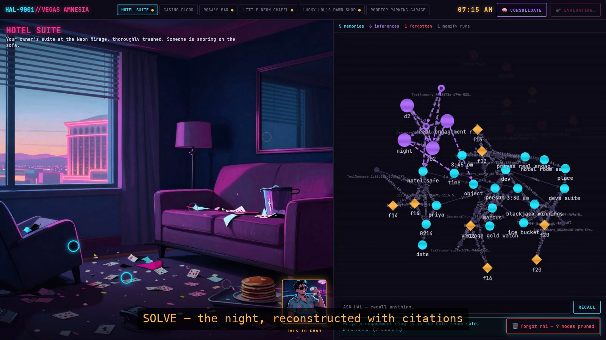

<div align="center">

# 🎰 VEGAS AMNESIA 🧠

**You are HAL-9001 — an AI assistant that woke up in Vegas with a wiped memory graph.**
Reconstruct last night before your owner's fiancée arrives at noon.

Every clue you find flows through **Cognee Cloud's full memory lifecycle** —
`remember → recall → memify → forget` — visualized as a live knowledge graph that **is** the game UI.

**[▶ PLAY NOW — vegas-amnesia.vercel.app](https://vegas-amnesia.vercel.app)**  ·  [mirror on 🤗 Spaces](https://himanshukumarjha-vegas-amnesia.hf.space)

*Built for the WeMakeDevs × Cognee **"The Hangover Part AI"** hackathon — Cognee Cloud track.*


🎬 **[Full demo video](docs/demo.mp4)** · 🧠 **[How we use Cognee (deep-dive cut)](docs/cognee-deep-dive.mp4)**

</div>

---

## The pitch

Your owner Dev had *a night*. At 6 AM your memory graph was corrupted. A polaroid wall says
there was a **ceremony**. There's a **ring** on Dev's finger that shouldn't exist, $8,000
missing, a lipstick-marked napkin, and a stranger snoring on the sofa.

You have until **noon** to answer one question:

> **"What happened last night — and where is the wedding ring?"**

Explore 6 locations, interrogate 4 LLM-driven characters (one of them is lying), collect ~20
facts, dodge 5 red herrings — and watch your literal memory come back node by node.

| | |
|---|---|
|  |  |

## Memory lifecycle usage (for the judges)

Every mechanic below is a **real Cognee Cloud API call** — verified live by
[`scripts/smoke_test.py`](scripts/smoke_test.py) and logged in-game (press <kbd>`</kbd> for the
raw call log with timings — the receipts).

| Lifecycle op | Cognee Cloud endpoint | In-game mechanic |
|---|---|---|
| `remember` | `POST /api/v1/remember` — multipart, auto-cognifies; **one data item per fact**, named by fact id | Inspect evidence / extract testimony → facts ingested → cyan nodes pop into the graph |
| `recall` | `POST /api/v1/recall` with `includeReferences` (+ `/search` for typed queries) | **"Ask HAL"** free-text questions + the final *Solve the Night* check — answers cite source nodes, which pulse amber |
| `memify` | `POST /api/v1/cognify` re-run with a custom **inference-extraction prompt**¹ + derived inferences remembered as new memory items | **CONSOLIDATE** button → purple, dash-edged inference nodes appear ("the real ring never left the safe…") |
| `forget` | `POST /api/v1/forget` with `dataId` — dedicated unified-deletion endpoint | **Right-click any memory → FORGET** — prune red herrings; nodes fade out for real. Forgetting a *true* fact is allowed (re-discoverable). Risk/reward. |

¹ Our Cognee Cloud tenant doesn't expose `/api/v1/memify`, so per the closest-equivalent rule
memify = a `cognify` re-run whose `customPrompt` extracts *inferred* temporal/causal/contradiction
relationships (see `MEMIFY_PROMPT` in [`backend/services/cognee_client.py`](backend/services/cognee_client.py)),
plus a derivation layer that commits inferences back into Cognee as first-class memories.

**Also:** every game session gets its **own Cognee dataset** (demo runs never pollute each
other), every response carries an incremental **`graph_delta`** so the frontend animates
changes instead of re-fetching, and the win condition is scored against remembered-vs-forgotten
ground-truth facts — you literally cannot win while your graph is contaminated with more than
one red herring.

## Architecture

```
 browser — vanilla JS + Cytoscape.js (no framework)
   │  inspect evidence · interrogate characters · consolidate · forget · Ask-HAL
   ▼
 FastAPI — HF Docker Space (also serves the static frontend; Vercel hosts a second front door)
   │  session_store  : session ⇄ its own Cognee dataset (+ graph-delta snapshots)
   │  game.py        : ground-truth fact reveals, solve scoring
   │  llm.py         : character dialogue (HF Qwen2.5-72B / Anthropic, scripted fallback)
   ▼
 Cognee Cloud tenant — remember / recall / memify / forget
   └─ GET /datasets/{id}/graph → Cytoscape deltas animated in the memory panel
```

- **Story**: [`story/ground_truth.json`](story/ground_truth.json) — 20 atomic facts, 5 red herrings
  (each debunkable), 4 derivable inferences. [`story/world.json`](story/world.json) — 6 locations,
  21 hotspots, 4 characters with knowledge maps (Lucky Lou lies until you find the receipt).
- **Dialogue**: deterministic fact reveals (reliable demo) + LLM-generated lines that get the
  player's **current graph contents** in the prompt — characters react to what you already know.
- **Resilience**: public play is rate-budgeted (per-IP/hour + global/day), sessions are capped
  with oldest-eviction + dataset cleanup, and Cognee errors degrade gracefully — the game loop
  never hard-crashes.

## Run locally

```bash
cp .env.example .env          # COGNEE_API_KEY (+ tenant COGNEE_BASE_URL), HF_TOKEN for dialogue
python -m venv .venv && .venv/bin/pip install -r backend/requirements.txt

.venv/bin/python scripts/smoke_test.py     # gate: all four lifecycle ops vs Cognee Cloud
.venv/bin/python -m pytest tests/ -q       # 23 tests, Cognee mocked

.venv/bin/uvicorn backend.app:app --reload --port 8000   # → http://localhost:8000
```

## Deploy

- **Backend + UI (single service)**: HF Docker Space — `python scripts/deploy_space.py`
  (secrets: `COGNEE_API_KEY`, `COGNEE_BASE_URL`, `HF_TOKEN`, optional `ACCESS_CODE`).
- **Frontend (static)**: Vercel — `npx vercel deploy --prod --yes`
  (`vercel.json` serves `frontend/`; `config.js` routes API calls to the Space).

## Repo layout

```
backend/
  services/   cognee_client.py (ALL Cognee calls, timed + logged) · llm.py · solve.py · sessions
  routers/    session / game / memory endpoints (each response ships a graph_delta)
  prompts/    graph-aware character dialogue prompt
story/        ground_truth.json (the true timeline) · world.json (locations/hotspots/characters)
frontend/     vanilla JS + Cytoscape.js · assets/manifest.json (art drops in without code changes)
scripts/      smoke_test.py · deploy_space.py · record_demo.mjs (scripted playthrough recorder)
tests/        23 offline tests (Cognee mocked to its verified live behavior)
docs/         demo.mp4 · cognee-deep-dive.mp4 · media/
```

## Credits & disclosures

- **Built with Claude Code** (AI-assistant disclosure, as required by hackathon rules) —
  including the demo video, which is a scripted-playthrough recording cut by the agent.
- Character portraits & location backdrops generated with **Higgsfield** (neon-noir painterly).
- Dialogue LLM: **Qwen2.5-72B-Instruct** via HuggingFace Inference API.
- Memory: **Cognee Cloud** — thanks for a genuinely fun API to build on. 🍸
