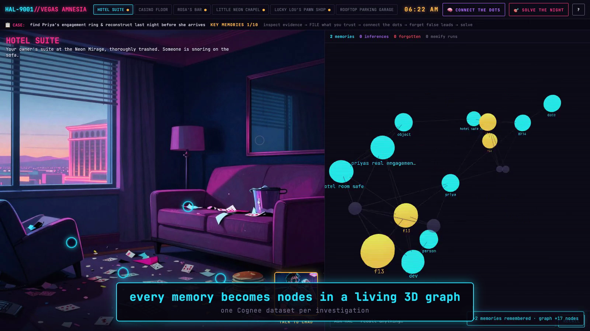

<div align="center">

# 🎰 VEGAS AMNESIA 🧠

### You are an AI whose memory was wiped. Reconstruct last night. Find the ring. Before noon.

**A detective game where [Cognee Cloud](https://www.cognee.ai)'s entire memory lifecycle —
`remember → recall → memify → forget` — IS the gameplay,
visualized as a live 3D knowledge graph.**

[**▶ PLAY IT NOW**](https://vegas-amnesia.vercel.app) · [🎬 Watch the demo (YouTube)](https://youtu.be/MM1nnQxJARo) · [🔬 Cognee deep-dive cut](docs/cognee-deep-dive.mp4) · [🤗 HF Space mirror](https://himanshukumarjha-vegas-amnesia.hf.space)

*WeMakeDevs × Cognee — "The Hangover Part AI" hackathon · Cognee Cloud track*


</div>

---

## The pitch

Your owner **Dev** had a wild night in Vegas. At 6 AM, your memory graph was corrupted.
His fiancée **Priya** lands at noon — and there's a suspicious ring on his finger.

You are **HAL-9001** (HAL 9000's slightly more helpful successor), and your mind is
literally a knowledge graph. Every piece of evidence you *file*, every witness confession,
becomes real memory in a real Cognee Cloud dataset — glowing nodes in a live 3D graph you
pop open whenever you want to think. Some evidence is a lie. Filing it poisons your memory.
Deleting it is the only cure. Reconstruct enough of the truth, purge the lies, and **Solve
the Night** — get it right and the timeline snaps back together in a burst of confetti; get
it wrong and the memory glitches out, incomplete.

## How the memory lifecycle became game mechanics

| Cognee op | Endpoint (all verified live — `scripts/smoke_test.py`) | In-game |
|---|---|---|
| **remember** | `POST /api/v1/remember` — one data item per fact, auto-cognified, named by fact id | 🗂 **FILE IT** — evidence & testimony become cyan graph nodes |
| **recall** | `POST /api/v1/recall` + `includeReferences` | ❓ **ASK HAL** — free-text questions; cited source nodes pulse amber |
| **memify** | `POST /api/v1/cognify` re-run with an inference-extraction prompt¹ + derived facts remembered | 🧠 **CONNECT THE DOTS** — purple inference nodes with particle edges |
| **forget** | `POST /api/v1/forget` with `dataId` | 🗑 **Memory Log** — review every filed memory, delete the red herrings; nodes die on screen, for real |

¹ Our tenant doesn't expose `/api/v1/memify`, so per the closest-equivalent rule memify =
`cognify` re-run whose `customPrompt` extracts temporal/causal/contradiction relationships
(see `MEMIFY_PROMPT` in [`backend/services/cognee_client.py`](backend/services/cognee_client.py)),
plus a derivation layer that remembers ground-truth inferences once their premises are in memory.

**Deep-usage receipts for the judges:**
- 🔑 **One Cognee dataset per game session** — demo runs never pollute each other; reset deletes the dataset.
- 📈 **Incremental `graph_delta`s** on every response — the frontend animates exactly what changed.
- 📎 **Citations everywhere** — recall answers carry chunk/document references; the ending timeline cites its nodes.
- ⌨️ **Press backtick in-game** for the raw lifecycle call log (op, dataset, latency, status) — live from the backend.

<div align="center">



</div>

## Playing it (2 minutes to learn)

1. 🔍 **Investigate** — six locations, ~20 evidence hotspots, glowing rings.
2. 🗂 **File what you trust** — inspecting is free; filing commits it to Cognee. *Not everything you find is true.*
3. 💬 **Interrogate** — Rosa, Lucky Lou, Rev. Sonny, and Chad are LLM-driven and **react to what your graph already knows**. One of them is lying — the graph can catch the contradiction.
4. 🧠 **Connect the dots** — consolidation derives inferences you never filed.
5. 🗑 **Forget the lies** — 5 red herrings are seeded through the story; carrying more than one costs you the case.
6. 🎯 **Solve the night** — coverage-scored against a 20-fact ground-truth timeline.

A first-boot **HOW TO PLAY** card teaches all of this in-game (`?` in the top bar).

## Architecture

```
 browser — vanilla JS + three.js 3D force graph (zero framework)
   │  file evidence / interrogate / connect-the-dots / forget / Ask HAL
   ▼
 FastAPI (single container: API + static frontend)      HF Docker Space
   │  session ←→ its own Cognee dataset · graph-delta snapshots · solve scoring
   │  llm.py: graph-aware character dialogue (HF Qwen 72B / Anthropic)
   ▼
 Cognee Cloud tenant — remember / recall / memify / forget
   └─ GET /datasets/{id}/graph → animated into the 3D memory panel
```

- **Frontend** [`frontend/`](frontend/) — vanilla JS, `3d-force-graph` (three.js), Higgsfield-generated art (6 backdrops, 4 portraits, 14 evidence items)
- **Backend** [`backend/`](backend/) — Python 3.11 / FastAPI; every Cognee call wrapped, timed, and logged in [`cognee_client.py`](backend/services/cognee_client.py)
- **Story** [`story/`](story/) — 20 ground-truth facts, 5 red herrings, 4 derivable inferences, 4 characters with knowledge maps
- **Tests** — 24 offline tests (Cognee mocked to its verified live behavior): `pytest tests/`

## Run it locally

```bash
cp .env.example .env          # COGNEE_API_KEY (+ COGNEE_BASE_URL, HF_TOKEN)
python -m venv .venv && .venv/bin/pip install -r backend/requirements.txt

.venv/bin/python scripts/smoke_test.py     # verify all 4 lifecycle ops against Cognee Cloud
.venv/bin/uvicorn backend.app:app --port 8000
# → http://localhost:8000
```

Deploy: push this repo to a HF Docker Space (secrets: `COGNEE_API_KEY`, `COGNEE_BASE_URL`,
`HF_TOKEN`) — or `npx vercel deploy --prod` for the static frontend, which talks to the Space.
Public play is rate-limited (per-IP + daily budget) so the Cognee tenant survives the internet;
an access code (in our submission notes) bypasses limits for judges.

## Demo videos

- 🎬 **[Watch on YouTube](https://youtu.be/MM1nnQxJARo)** — 63s, narrated: full gameplay + all four lifecycle stages
- [`docs/demo.mp4`](docs/demo.mp4) — the same cut, in-repo
- [`docs/cognee-deep-dive.mp4`](docs/cognee-deep-dive.mp4) — 44s, endpoint-level captions (no narration, talk over it)
- Fully reproducible: `record_demo.mjs` (scripted playthrough) → `make_cards.mjs` (HTML-rendered neon cards) → `build_demo_v2.sh` → `make_narration.sh` (neural TTS) → `mux_audio.sh`

## Disclosures

Built with **Claude Code** (per hackathon rules). Art generated with **Higgsfield** (soul_2).
Dialogue: **Qwen2.5-72B** via HF Inference API. Memory: **Cognee Cloud** — and nothing else;
there is no local fact store, the graph you see is the dataset.

<div align="center">

**🎲 The house always remembers.**

</div>
